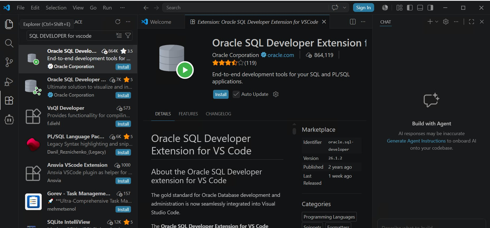
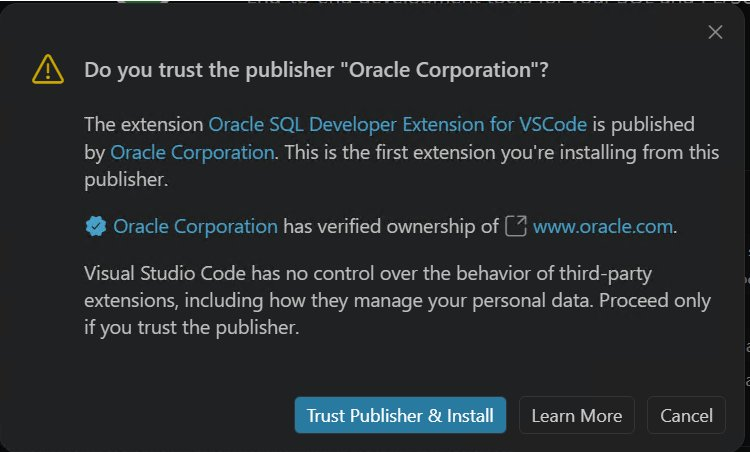
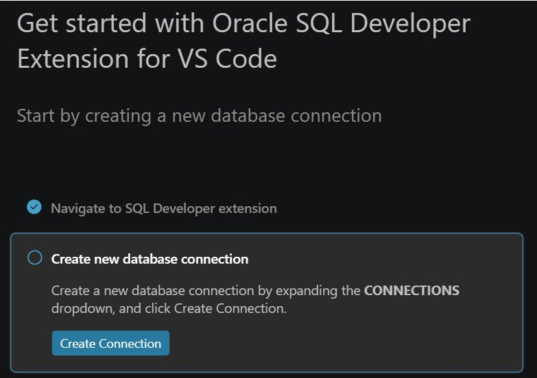
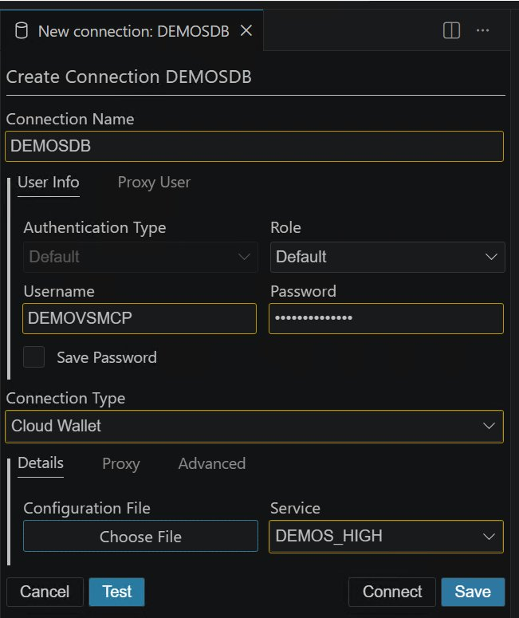
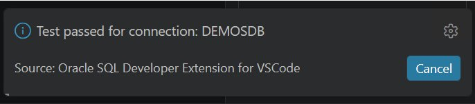
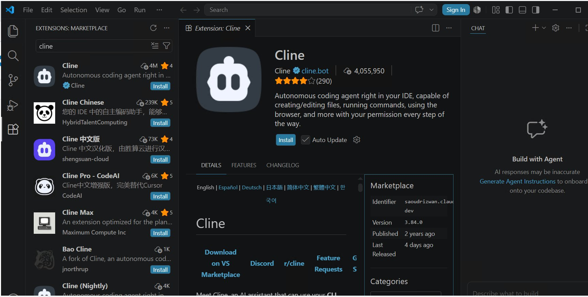
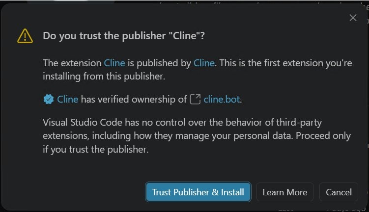
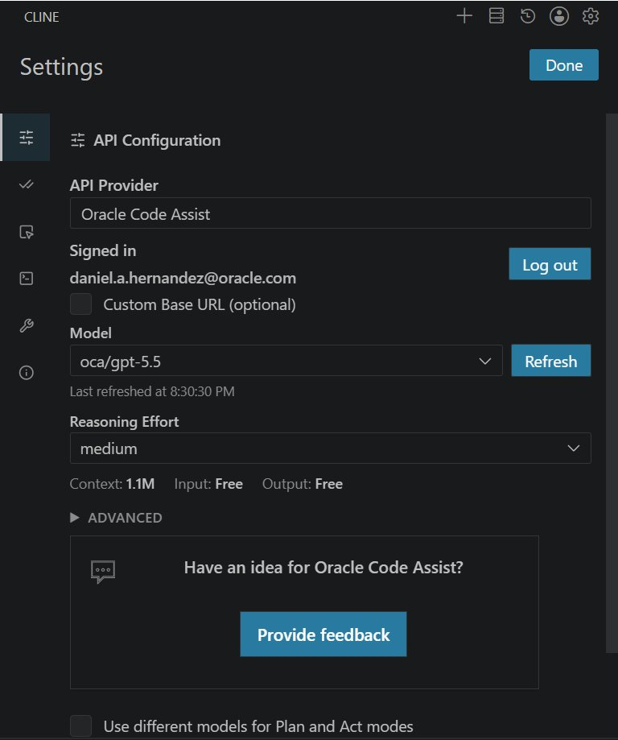
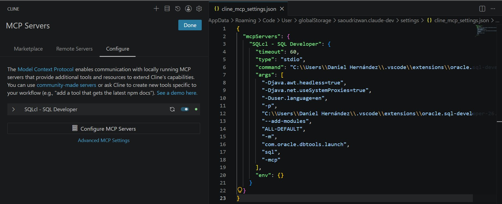

# Oracle AI Developer Setup: VS Code + SQL Developer + Cline + Oracle Code Assist + MCP

Guía completa para configurar un entorno de desarrollo con inteligencia artificial para Oracle Database usando VS Code, la extensión SQL Developer, el agente Cline con Oracle Code Assist, y el servidor MCP de SQLcl.

---

## Tabla de Contenidos

1. [Descargar e Instalar VS Code](#1-descargar-e-instalar-vs-code)
2. [Instalar la Extensión SQL Developer for VS Code](#2-instalar-la-extensión-sql-developer-for-vs-code)
3. [Configurar Conexión a ADB (DEMOADB / DEMOS_HIGH)](#3-configurar-conexión-a-adb-demoadb--demos_high)
4. [Instalar la Extensión Cline](#4-instalar-la-extensión-cline)
5. [Configurar Cline con Oracle Code Assist](#5-configurar-cline-con-oracle-code-assist)
6. [Configurar el MCP dentro de Cline](#6-configurar-el-mcp-dentro-de-cline)
7. [Ejecutar tu Primera Consulta en la DB](#7-ejecutar-tu-primera-consulta-en-la-db)
8. [Crear Tabla de Clientes con 10 Registros](#8-crear-tabla-de-clientes-con-10-registros)
9. [Crear Tabla de Teléfonos con 2 por Cliente](#9-crear-tabla-de-teléfonos-con-2-por-cliente)

---

## Requisitos Previos

- Windows 10/11 de 64 bits
- Conexión a internet
- Cuenta en Oracle Cloud Infrastructure (OCI) con acceso a:
  - Oracle Autonomous Database (ADB) `DEMOADB` versión 23ai
  - Oracle Code Assist habilitado en el tenancy
- Wallet de la ADB descargado (archivo ZIP)
- Credenciales de usuario de base de datos (usuario personalizado por persona)

---

## 1. Descargar e Instalar VS Code

### 1.1 Descarga

1. Abre tu navegador y ve a: **[https://code.visualstudio.com/download](https://code.visualstudio.com/download)**
2. Haz clic en el botón **Windows** (descarga el instalador `.exe` de 64 bits, versión "User Installer").

### 1.2 Instalación

1. Ejecuta el archivo descargado (p. ej. `VSCodeUserSetup-x64-x.xx.x.exe`).
2. Acepta el acuerdo de licencia y haz clic en **Siguiente**.
3. En la pantalla de opciones adicionales, **marca las siguientes casillas**:
   - ✅ Agregar acción "Abrir con Code" al menú contextual de archivos
   - ✅ Agregar acción "Abrir con Code" al menú contextual de directorios
   - ✅ Registrar Code como editor para tipos de archivo admitidos
   - ✅ Agregar a PATH (para usarlo desde la terminal)
4. Haz clic en **Instalar** y luego en **Finalizar**.

### 1.3 Verificación

Abre VS Code. Deberías ver la pantalla de bienvenida con el logo azul. Si se abre correctamente, la instalación fue exitosa.

---

## 2. Instalar la Extensión SQL Developer for VS Code

### 2.1 Abrir el Marketplace de Extensiones

1. En VS Code, haz clic en el ícono de **Extensiones** en la barra lateral izquierda (o presiona `Ctrl+Shift+X`).
2. En el cuadro de búsqueda, escribe: `Oracle SQL Developer`

### 2.2 Instalar la Extensión

1. Selecciona la extensión **"Oracle SQL Developer Extension for VS Code"** publicada por **Oracle Corporation** (versión 26.1.2 o superior).
2. Haz clic en el botón **Install**.



3. VS Code mostrará un diálogo de confirmación de confianza del publicador. Haz clic en **"Trust Publisher & Install"** para continuar.



4. Espera a que se complete la instalación. VS Code puede solicitarte recargar la ventana — acepta.

### 2.3 Verificación

Después de la instalación, verás un nuevo ícono de Oracle en la barra lateral izquierda (un cilindro con el logo de base de datos). Al hacer clic se despliega el panel de SQL Developer con la opción de crear tu primera conexión.



---

## 3. Configurar Conexión a ADB (DEMOADB / DEMOS_HIGH)

### 3.1 Preparar el Wallet

El Wallet es un archivo ZIP que Oracle Cloud proporciona para conexiones seguras a la ADB. Si no lo tienes aún:

1. Inicia sesión en [cloud.oracle.com](https://cloud.oracle.com)
2. Navega a **Oracle Database → Autonomous Database → DEMOADB**
3. Haz clic en **DB Connection**
4. En "Wallet Type" selecciona **Instance Wallet** y haz clic en **Download wallet**
5. Establece una contraseña para el wallet y descárgalo

Extrae el archivo ZIP en una carpeta fácil de recordar, por ejemplo:

```
C:\oracle\wallet\DEMOADB\
```

> ⚠️ **No muevas ni renombres los archivos dentro del wallet.** La carpeta debe contener archivos como `cwallet.sso`, `ewallet.p12`, `tnsnames.ora`, `sqlnet.ora`, entre otros.

### 3.2 Editar sqlnet.ora

Abre el archivo `sqlnet.ora` dentro de la carpeta del wallet con un editor de texto y verifica que la línea `DIRECTORY` apunta a la ruta correcta de tu wallet:

```
WALLET_LOCATION = (SOURCE = (METHOD = file) (METHOD_DATA = (DIRECTORY="C:\oracle\wallet\DEMOADB")))
SSL_SERVER_DN_MATCH=yes
```

> Reemplaza la ruta por la ubicación real donde extrajiste el wallet en tu máquina.

### 3.3 Crear la Conexión en SQL Developer for VS Code

1. Haz clic en el ícono de Oracle en la barra lateral de VS Code.
2. En el panel de conexiones, haz clic en el botón **"+"** (Nueva Conexión) o en **"Add Connection"**.
3. Completa el formulario con los siguientes datos:

| Campo | Valor |
|---|---|
| **Connection Name** | `DEMOS_HIGH` |
| **Authentication Type** | Default (Database) |
| **Username** | `TU_USUARIO` *(usuario personalizado asignado)* |
| **Password** | *(tu contraseña de base de datos)* |
| **Save Password** | ✅ (opcional, según política de seguridad) |
| **Connection Type** | Cloud Wallet |
| **Configuration File** | Ruta al archivo ZIP del wallet **o** a la carpeta extraída |
| **Service** | `DEMOS_HIGH` |



> 💡 **Sobre el nombre del servicio:** Los servicios disponibles aparecerán automáticamente al seleccionar el archivo de wallet. Elige `DEMOS_HIGH` para mayor rendimiento (equivale al nivel HIGH en la ADB).

4. Haz clic en **Test** para verificar la conectividad.
5. Si el test es exitoso verás el mensaje **"Test passed for connection: DEMOS_HIGH"**. Haz clic en **Save** o **Connect**.



### 3.4 Abrir una Hoja de Trabajo SQL

1. Una vez conectado, haz clic derecho sobre la conexión `DEMOS_HIGH`.
2. Selecciona **"Open SQL Worksheet"** u **"Open New SQL File"**.
3. Prueba la conexión ejecutando:

```sql
SELECT SYSDATE FROM DUAL;
```

Presiona `Ctrl+Enter` o el botón de ejecutar (▶). Si ves la fecha actual, la conexión está funcionando correctamente.

---

## 4. Instalar la Extensión Cline

Cline es un agente de IA autónomo que opera directamente dentro de VS Code, capaz de leer archivos, ejecutar comandos y usar servidores MCP.

### 4.1 Instalación desde el Marketplace

1. En VS Code, abre el panel de extensiones (`Ctrl+Shift+X`).
2. Busca: `Cline`
3. Selecciona la extensión **"Cline"** publicada por **Cline** (identificador `saoudrizwan.claude-dev`, versión 3.84.0 o superior, con más de 4 millones de instalaciones).



4. Haz clic en **Install**. VS Code mostrará el diálogo de confianza del publicador — haz clic en **"Trust Publisher & Install"**.



### 4.2 Verificación

Después de instalar, aparecerá un nuevo ícono de Cline (🤖) en la barra lateral izquierda. Al hacer clic se abre el panel del agente.

---

## 5. Configurar Cline con Oracle Code Assist

Oracle Code Assist (OCA) es el servicio de IA generativa de Oracle, accesible a través de OCI Generative AI. Cline lo soporta nativamente como proveedor.

### 5.1 Abrir la Configuración de Cline

1. Haz clic en el ícono de Cline en la barra lateral.
2. En la parte superior del panel de Cline, haz clic en el ícono de **configuración** (⚙️).

### 5.2 Seleccionar Oracle Code Assist como Proveedor

1. En el campo **"API Provider"**, despliega el menú y selecciona: **`Oracle Code Assist`**
2. En el campo **"Mode"**, selecciona: **`external`** *(para cuentas que NO son de empleados Oracle)*

### 5.3 Autenticación con OCI

Cline usará tu configuración estándar de OCI (`~/.oci/config`) para autenticarse.

Si aún no tienes tu archivo de configuración OCI, sigue estos pasos:

#### Crear el archivo de configuración OCI

1. Crea la carpeta `C:\Users\TU_USUARIO\.oci\`
2. Crea el archivo `C:\Users\TU_USUARIO\.oci\config` con el siguiente contenido:

```ini
[DEFAULT]
user=ocid1.user.oc1..aaaaaaaXXXXXXXXXXXXXXXXXXXXXXXXXXXXXXXXXXX
fingerprint=xx:xx:xx:xx:xx:xx:xx:xx:xx:xx:xx:xx:xx:xx:xx:xx
tenancy=ocid1.tenancy.oc1..aaaaaaaXXXXXXXXXXXXXXXXXXXXXXXXXXXXXX
region=us-chicago-1
key_file=C:\Users\TU_USUARIO\.oci\oci_api_key.pem
```

> Reemplaza los valores con los datos reales de tu tenancy OCI. La región debe ser donde tengas OCI Generative AI habilitado (normalmente `us-chicago-1` o `eu-frankfurt-1`).

3. Coloca tu clave privada PEM en: `C:\Users\TU_USUARIO\.oci\oci_api_key.pem`

#### Primer inicio de sesión

La primera vez que uses Oracle Code Assist en Cline:

1. Cline mostrará un mensaje solicitando autenticación.
2. Se abrirá tu navegador automáticamente con la página de inicio de sesión de Oracle Identity.
3. Inicia sesión con tu cuenta OCI.
4. Una vez autenticado, regresa a VS Code.

### 5.4 Seleccionar el Modelo

Después de autenticarte, en el selector de **modelo** dentro de la configuración de Cline, elige el modelo disponible en tu tenancy (por ejemplo `oca/gpt-5.5` como se muestra en la imagen, o el modelo que tengas habilitado en OCA). Haz clic en **Refresh** para que Cline descubra automáticamente los modelos disponibles.



> 💡 **Nota:** Como se puede ver en la pantalla, el uso es **Input: Free / Output: Free** — Oracle Code Assist no tiene costo adicional para los usuarios con acceso habilitado en el tenancy OCI. El contexto disponible es de **1.1M tokens**.

### 5.5 Guardar y Verificar

Haz clic en **"Save"**. En el panel de chat de Cline, escribe un mensaje de prueba:

```
Hola, ¿puedes ayudarme con código PL/SQL?
```

Si obtienes una respuesta, Oracle Code Assist está correctamente configurado.

---

## 6. Configurar el MCP dentro de Cline

El servidor MCP (Model Context Protocol) de SQLcl permite que el agente Cline interactúe directamente con tu base de datos Oracle usando lenguaje natural.

### 6.1 Usar el JDK Bundled de la Extensión

> ⚠️ **Error común:** NO uses el `sql.exe` directamente como comando MCP. Esto provoca el error `Unrecognized option: --add-opens`. El SQLcl del plugin debe ejecutarse con el **JDK bundled** incluido dentro de la extensión SQL Developer.

### 6.2 Localizar las Rutas Necesarias

Primero identifica la versión exacta instalada de la extensión SQL Developer. Busca la carpeta en:

```
C:\Users\TU_USUARIO\.vscode\extensions\
```

Busca una carpeta con nombre similar a:

```
oracle.sql-developer-26.1.2-win32-x64
```

> ⚠️ El número de versión (`26.1.2`) puede variar según la versión instalada. Ajusta las rutas del JSON a continuación según la versión que tengas.

Las dos rutas clave que necesitas son:

| Elemento | Ruta |
|---|---|
| Java ejecutable (bundled) | `...\oracle.sql-developer-26.1.2-win32-x64\dbtools\jdk\bin\java.exe` |
| Módulo launch SQLcl | `...\oracle.sql-developer-26.1.2-win32-x64\dbtools\launch\` |
| Módulo launch SQLcl (2) | `...\oracle.sql-developer-26.1.2-win32-x64\dbtools\sqlcl\launch\` |

### 6.3 Abrir el Archivo de Configuración MCP de Cline

1. En el panel de Cline, haz clic en el ícono ⚙️.
2. Busca la sección **"MCP Servers"** y haz clic en **"Edit MCP Settings"** (o abre directamente el archivo `cline_mcp_settings.json`).

### 6.4 Agregar la Configuración del Servidor MCP

Reemplaza o agrega la siguiente configuración (ajusta `TU_USUARIO` y el número de versión de la extensión):

```json
{
  "mcpServers": {
    "SQLcl - SQL Developer": {
      "timeout": 60,
      "type": "stdio",
      "command": "C:\\Users\\TU_USUARIO\\.vscode\\extensions\\oracle.sql-developer-26.1.2-win32-x64\\dbtools\\jdk\\bin\\java.exe",
      "args": [
        "-Djava.awt.headless=true",
        "-Djava.net.useSystemProxies=true",
        "-Duser.language=en",
        "-p",
        "C:\\Users\\TU_USUARIO\\.vscode\\extensions\\oracle.sql-developer-26.1.2-win32-x64\\dbtools\\launch\\;C:\\Users\\TU_USUARIO\\.vscode\\extensions\\oracle.sql-developer-26.1.2-win32-x64\\dbtools\\sqlcl\\launch\\",
        "--add-modules",
        "ALL-DEFAULT",
        "-m",
        "com.oracle.dbtools.launch",
        "sql",
        "-mcp"
      ],
      "env": {}
    }
  }
}
```

> 💡 **Nota sobre el separador de rutas en `-p`:** En Windows se usa `;` (punto y coma). En Linux/macOS se usa `:` (dos puntos).

### 6.5 Agregar TNS Admin (si usas wallet)

Si tu conexión usa wallet (como es el caso de ADB), agrega el argumento `-tnsadmin` con la ruta a la carpeta del wallet:

```json
"args": [
  "-Djava.awt.headless=true",
  "-Djava.net.useSystemProxies=true",
  "-Duser.language=en",
  "-p",
  "C:\\Users\\TU_USUARIO\\.vscode\\extensions\\oracle.sql-developer-26.1.2-win32-x64\\dbtools\\launch\\;C:\\Users\\TU_USUARIO\\.vscode\\extensions\\oracle.sql-developer-26.1.2-win32-x64\\dbtools\\sqlcl\\launch\\",
  "--add-modules",
  "ALL-DEFAULT",
  "-m",
  "com.oracle.dbtools.launch",
  "sql",
  "-mcp",
  "-tnsadmin",
  "C:\\oracle\\wallet\\DEMOADB"
]
```

### 6.6 Guardar y Reiniciar

1. Guarda el archivo JSON (`cline_mcp_settings.json`).
2. En el panel de Cline, ve a la sección **MCP Servers** → pestaña **Configure** para verificar el estado del servidor.
3. Si el servidor **"SQLcl - SQL Developer"** aparece con el indicador en **verde** (●), la configuración es correcta y el agente puede comunicarse con la base de datos.



> 💡 El archivo `cline_mcp_settings.json` se encuentra en:
> `C:\Users\TU_USUARIO\AppData\Roaming\Code\User\globalStorage\saoudrizwan.claude-dev\settings\`

### 6.7 Método Alternativo: Configuración Automática desde la Extensión

La extensión SQL Developer for VS Code puede generar la configuración MCP automáticamente:

1. Abre la paleta de comandos de VS Code: `Ctrl+Shift+P`
2. Escribe: `SQLcl` y busca la opción **"Configure MCP for Cline"** o **"Add SQLcl MCP to Cline"**
3. Si esta opción existe en tu versión, selecciónala y la extensión insertará la configuración correcta automáticamente.

---

## 7. Ejecutar tu Primera Consulta en la DB

Con el MCP activo, el agente Cline puede ejecutar SQL directamente en tu base de datos Oracle mediante lenguaje natural.

### 7.1 Conectarse a la Base de Datos a través del Agente

En el panel de chat de Cline, escribe el siguiente prompt:

```
Conéctate a la base de datos usando la conexión DEMOS_HIGH con el usuario TU_USUARIO
y ejecuta las siguientes consultas:
1. SELECT SYSDATE FROM DUAL
2. SELECT NAME FROM V$DATABASE
3. SELECT BANNER FROM V$VERSION WHERE BANNER LIKE 'Oracle%'
```

> El agente usará el MCP de SQLcl para conectarse y devolverte los resultados directamente en el chat.

### 7.2 Consultas de Referencia

Si prefieres ejecutarlas manualmente en el SQL Worksheet de SQL Developer:

```sql
-- Fecha y hora del servidor
SELECT SYSDATE FROM DUAL;

-- Nombre de la base de datos
SELECT NAME FROM V$DATABASE;

-- Versión de Oracle Database
SELECT BANNER FROM V$VERSION WHERE BANNER LIKE 'Oracle%';
```

**Resultados esperados:**

| Consulta | Resultado de ejemplo |
|---|---|
| SYSDATE | `24/05/2026 10:30:45` |
| NAME | `DEMOADB` |
| BANNER | `Oracle Database 23ai Enterprise Edition Release 23.0.0.0.0` |

---

## 8. Crear Tabla de Clientes con 10 Registros

### 8.1 Usando el Agente Cline (Recomendado)

En el chat de Cline, escribe:

```
Conéctate a DEMOS_HIGH y crea una tabla llamada CLIENTES con los campos:
- ID_CLIENTE (número, clave primaria, autoincremental)
- NOMBRE (varchar2 100, requerido)
- APELLIDO (varchar2 100, requerido)
- EMAIL (varchar2 200, único)
- FECHA_NACIMIENTO (date)
- CIUDAD (varchar2 100)
- PAIS (varchar2 50, default 'Costa Rica')
- FECHA_REGISTRO (date, default sysdate)

Luego inserta 10 clientes de ejemplo con datos realistas de Latinoamérica.
```

### 8.2 Script SQL de Referencia

Si deseas ejecutarlo manualmente en el SQL Worksheet:

```sql
-- Eliminar tabla si existe (para re-ejecución limpia)
BEGIN
  EXECUTE IMMEDIATE 'DROP TABLE TELEFONOS CASCADE CONSTRAINTS';
EXCEPTION WHEN OTHERS THEN NULL;
END;
/
BEGIN
  EXECUTE IMMEDIATE 'DROP TABLE CLIENTES CASCADE CONSTRAINTS';
EXCEPTION WHEN OTHERS THEN NULL;
END;
/

-- Crear secuencia para ID autoincremental
CREATE SEQUENCE SEQ_CLIENTES START WITH 1 INCREMENT BY 1 NOCACHE NOCYCLE;

-- Crear tabla CLIENTES
CREATE TABLE CLIENTES (
    ID_CLIENTE      NUMBER          DEFAULT SEQ_CLIENTES.NEXTVAL PRIMARY KEY,
    NOMBRE          VARCHAR2(100)   NOT NULL,
    APELLIDO        VARCHAR2(100)   NOT NULL,
    EMAIL           VARCHAR2(200)   UNIQUE,
    FECHA_NACIMIENTO DATE,
    CIUDAD          VARCHAR2(100),
    PAIS            VARCHAR2(50)    DEFAULT 'Costa Rica',
    FECHA_REGISTRO  DATE            DEFAULT SYSDATE
);

-- Insertar 10 clientes de ejemplo
INSERT INTO CLIENTES (NOMBRE, APELLIDO, EMAIL, FECHA_NACIMIENTO, CIUDAD, PAIS)
VALUES ('Carlos', 'Rodríguez', 'carlos.rodriguez@email.com', DATE '1985-03-15', 'San José', 'Costa Rica');

INSERT INTO CLIENTES (NOMBRE, APELLIDO, EMAIL, FECHA_NACIMIENTO, CIUDAD, PAIS)
VALUES ('María', 'González', 'maria.gonzalez@email.com', DATE '1990-07-22', 'Guatemala City', 'Guatemala');

INSERT INTO CLIENTES (NOMBRE, APELLIDO, EMAIL, FECHA_NACIMIENTO, CIUDAD, PAIS)
VALUES ('José', 'Hernández', 'jose.hernandez@email.com', DATE '1978-11-05', 'Tegucigalpa', 'Honduras');

INSERT INTO CLIENTES (NOMBRE, APELLIDO, EMAIL, FECHA_NACIMIENTO, CIUDAD, PAIS)
VALUES ('Ana', 'Martínez', 'ana.martinez@email.com', DATE '1995-01-30', 'Managua', 'Nicaragua');

INSERT INTO CLIENTES (NOMBRE, APELLIDO, EMAIL, FECHA_NACIMIENTO, CIUDAD, PAIS)
VALUES ('Luis', 'López', 'luis.lopez@email.com', DATE '1982-09-14', 'Panamá', 'Panamá');

INSERT INTO CLIENTES (NOMBRE, APELLIDO, EMAIL, FECHA_NACIMIENTO, CIUDAD, PAIS)
VALUES ('Laura', 'Pérez', 'laura.perez@email.com', DATE '1993-04-08', 'San Salvador', 'El Salvador');

INSERT INTO CLIENTES (NOMBRE, APELLIDO, EMAIL, FECHA_NACIMIENTO, CIUDAD, PAIS)
VALUES ('Miguel', 'Sánchez', 'miguel.sanchez@email.com', DATE '1988-12-19', 'Bogotá', 'Colombia');

INSERT INTO CLIENTES (NOMBRE, APELLIDO, EMAIL, FECHA_NACIMIENTO, CIUDAD, PAIS)
VALUES ('Sofía', 'Torres', 'sofia.torres@email.com', DATE '1996-06-25', 'Lima', 'Perú');

INSERT INTO CLIENTES (NOMBRE, APELLIDO, EMAIL, FECHA_NACIMIENTO, CIUDAD, PAIS)
VALUES ('Andrés', 'Ramírez', 'andres.ramirez@email.com', DATE '1975-08-03', 'Buenos Aires', 'Argentina');

INSERT INTO CLIENTES (NOMBRE, APELLIDO, EMAIL, FECHA_NACIMIENTO, CIUDAD, PAIS)
VALUES ('Valentina', 'Flores', 'valentina.flores@email.com', DATE '1999-02-17', 'Ciudad de México', 'México');

COMMIT;

-- Verificar inserción
SELECT ID_CLIENTE, NOMBRE, APELLIDO, CIUDAD, PAIS FROM CLIENTES ORDER BY ID_CLIENTE;
```

**Resultado esperado:** 10 filas en la tabla CLIENTES.

---

## 9. Crear Tabla de Teléfonos con 2 por Cliente

### 9.1 Usando el Agente Cline (Recomendado)

En el chat de Cline, escribe:

```
Crea una tabla llamada TELEFONOS relacionada con la tabla CLIENTES, con los campos:
- ID_TELEFONO (número, clave primaria, autoincremental)
- ID_CLIENTE (número, clave foránea a CLIENTES)
- TIPO (varchar2 20: CELULAR, FIJO, TRABAJO)
- NUMERO (varchar2 20, requerido)
- EXTENSION (varchar2 10, opcional)
- ES_PRINCIPAL (char 1, valores Y/N, default N)

Inserta 2 teléfonos por cada uno de los 10 clientes existentes.
```

### 9.2 Script SQL de Referencia

```sql
-- Crear secuencia para ID autoincremental de teléfonos
CREATE SEQUENCE SEQ_TELEFONOS START WITH 1 INCREMENT BY 1 NOCACHE NOCYCLE;

-- Crear tabla TELEFONOS
CREATE TABLE TELEFONOS (
    ID_TELEFONO     NUMBER          DEFAULT SEQ_TELEFONOS.NEXTVAL PRIMARY KEY,
    ID_CLIENTE      NUMBER          NOT NULL,
    TIPO            VARCHAR2(20)    DEFAULT 'CELULAR'
                                    CHECK (TIPO IN ('CELULAR', 'FIJO', 'TRABAJO')),
    NUMERO          VARCHAR2(20)    NOT NULL,
    EXTENSION       VARCHAR2(10),
    ES_PRINCIPAL    CHAR(1)         DEFAULT 'N'
                                    CHECK (ES_PRINCIPAL IN ('Y', 'N')),
    CONSTRAINT FK_TELEFONO_CLIENTE
        FOREIGN KEY (ID_CLIENTE) REFERENCES CLIENTES (ID_CLIENTE) ON DELETE CASCADE
);

-- Insertar 2 teléfonos por cada cliente (20 registros en total)

-- Cliente 1 - Carlos Rodríguez
INSERT INTO TELEFONOS (ID_CLIENTE, TIPO, NUMERO, ES_PRINCIPAL)
VALUES (1, 'CELULAR', '+506 8888-1001', 'Y');
INSERT INTO TELEFONOS (ID_CLIENTE, TIPO, NUMERO, ES_PRINCIPAL)
VALUES (1, 'FIJO', '+506 2222-1001', 'N');

-- Cliente 2 - María González
INSERT INTO TELEFONOS (ID_CLIENTE, TIPO, NUMERO, ES_PRINCIPAL)
VALUES (2, 'CELULAR', '+502 5555-2001', 'Y');
INSERT INTO TELEFONOS (ID_CLIENTE, TIPO, NUMERO, ES_PRINCIPAL)
VALUES (2, 'TRABAJO', '+502 2222-2001', 'N');

-- Cliente 3 - José Hernández
INSERT INTO TELEFONOS (ID_CLIENTE, TIPO, NUMERO, ES_PRINCIPAL)
VALUES (3, 'CELULAR', '+504 9999-3001', 'Y');
INSERT INTO TELEFONOS (ID_CLIENTE, TIPO, NUMERO, ES_PRINCIPAL)
VALUES (3, 'FIJO', '+504 2222-3001', 'N');

-- Cliente 4 - Ana Martínez
INSERT INTO TELEFONOS (ID_CLIENTE, TIPO, NUMERO, ES_PRINCIPAL)
VALUES (4, 'CELULAR', '+505 8888-4001', 'Y');
INSERT INTO TELEFONOS (ID_CLIENTE, TIPO, NUMERO, ES_PRINCIPAL)
VALUES (4, 'TRABAJO', '+505 2222-4001', 'N');

-- Cliente 5 - Luis López
INSERT INTO TELEFONOS (ID_CLIENTE, TIPO, NUMERO, ES_PRINCIPAL)
VALUES (5, 'CELULAR', '+507 6666-5001', 'Y');
INSERT INTO TELEFONOS (ID_CLIENTE, TIPO, NUMERO, ES_PRINCIPAL)
VALUES (5, 'FIJO', '+507 2222-5001', 'N');

-- Cliente 6 - Laura Pérez
INSERT INTO TELEFONOS (ID_CLIENTE, TIPO, NUMERO, ES_PRINCIPAL)
VALUES (6, 'CELULAR', '+503 7777-6001', 'Y');
INSERT INTO TELEFONOS (ID_CLIENTE, TIPO, NUMERO, ES_PRINCIPAL)
VALUES (6, 'TRABAJO', '+503 2222-6001', 'N');

-- Cliente 7 - Miguel Sánchez
INSERT INTO TELEFONOS (ID_CLIENTE, TIPO, NUMERO, ES_PRINCIPAL)
VALUES (7, 'CELULAR', '+57 300-7001001', 'Y');
INSERT INTO TELEFONOS (ID_CLIENTE, TIPO, NUMERO, ES_PRINCIPAL)
VALUES (7, 'FIJO', '+57 1-7001001', 'N');

-- Cliente 8 - Sofía Torres
INSERT INTO TELEFONOS (ID_CLIENTE, TIPO, NUMERO, ES_PRINCIPAL)
VALUES (8, 'CELULAR', '+51 999-800100', 'Y');
INSERT INTO TELEFONOS (ID_CLIENTE, TIPO, NUMERO, ES_PRINCIPAL)
VALUES (8, 'TRABAJO', '+51 1-8001001', 'N');

-- Cliente 9 - Andrés Ramírez
INSERT INTO TELEFONOS (ID_CLIENTE, TIPO, NUMERO, ES_PRINCIPAL)
VALUES (9, 'CELULAR', '+54 11-9001001', 'Y');
INSERT INTO TELEFONOS (ID_CLIENTE, TIPO, NUMERO, ES_PRINCIPAL)
VALUES (9, 'FIJO', '+54 11-9001002', 'N');

-- Cliente 10 - Valentina Flores
INSERT INTO TELEFONOS (ID_CLIENTE, TIPO, NUMERO, ES_PRINCIPAL)
VALUES (10, 'CELULAR', '+52 55-1000001', 'Y');
INSERT INTO TELEFONOS (ID_CLIENTE, TIPO, NUMERO, ES_PRINCIPAL)
VALUES (10, 'TRABAJO', '+52 55-1000002', 'N');

COMMIT;

-- Verificar: clientes con sus teléfonos
SELECT
    c.ID_CLIENTE,
    c.NOMBRE || ' ' || c.APELLIDO AS CLIENTE,
    c.CIUDAD,
    t.TIPO,
    t.NUMERO,
    t.ES_PRINCIPAL
FROM
    CLIENTES c
    JOIN TELEFONOS t ON c.ID_CLIENTE = t.ID_CLIENTE
ORDER BY
    c.ID_CLIENTE, t.ES_PRINCIPAL DESC;
```

**Resultado esperado:** 20 filas (2 teléfonos × 10 clientes), mostrando cada cliente con su teléfono principal primero.

---

## Diagrama del Modelo de Datos

```
┌──────────────────────────────────┐       ┌──────────────────────────────────┐
│           CLIENTES               │       │           TELEFONOS              │
├──────────────────────────────────┤       ├──────────────────────────────────┤
│ ID_CLIENTE      NUMBER  PK       │◄──┐   │ ID_TELEFONO    NUMBER  PK        │
│ NOMBRE          VARCHAR2(100)    │   └───│ ID_CLIENTE     NUMBER  FK        │
│ APELLIDO        VARCHAR2(100)    │       │ TIPO           VARCHAR2(20)      │
│ EMAIL           VARCHAR2(200) UQ │       │ NUMERO         VARCHAR2(20)      │
│ FECHA_NACIMIENTO DATE            │       │ EXTENSION      VARCHAR2(10)      │
│ CIUDAD          VARCHAR2(100)    │       │ ES_PRINCIPAL   CHAR(1)           │
│ PAIS            VARCHAR2(50)     │       └──────────────────────────────────┘
│ FECHA_REGISTRO  DATE             │
└──────────────────────────────────┘
```

---

## Resolución de Problemas Comunes

### Error: `Unrecognized option: --add-opens`

**Causa:** Se está usando el `sql.exe` directamente como comando MCP en lugar del JDK bundled.

**Solución:** Usa la configuración JSON del [paso 6.4](#64-agregar-la-configuración-del-servidor-mcp), que invoca el `java.exe` bundled dentro de la extensión SQL Developer.

---

### Error: `MCP error -32000: Connection closed`

**Causas posibles:**

1. La ruta al JDK bundled es incorrecta → Verifica que la versión de la extensión en la ruta coincida con la instalada.
2. El módulo `-p` tiene rutas mal formadas → En Windows usa `\` y separa con `;`.
3. El wallet no está configurado → Agrega `-tnsadmin` con la ruta correcta.

---

### Error: `ORA-01017: invalid username/password`

**Solución:** Verifica las credenciales del usuario en la conexión `DEMOS_HIGH`. Asegúrate de no confundir el usuario de base de datos con el usuario de OCI.

---

### El modelo de Oracle Code Assist no aparece en Cline

**Solución:**

1. Verifica que `ocacopilot.mode` esté en `external`.
2. Confirma que tu cuenta OCI tenga OCA habilitado en el tenancy.
3. Revisa los logs de Cline (`Ctrl+Shift+P` → "Cline: Open Logs").

---

### El servidor MCP aparece en rojo en Cline

**Solución:**

1. Confirma que el archivo `java.exe` del JDK bundled existe en la ruta indicada.
2. Reinicia VS Code completamente.
3. Revisa los logs del servidor MCP en la sección MCP de Cline.

---

## Referencias

- [VS Code Download](https://code.visualstudio.com/download)
- [Oracle SQL Developer for VS Code](https://www.oracle.com/database/sqldeveloper/vscode/)
- [Oracle Code Assist](https://www.oracle.com/application-development/code-assist/)
- [Cline Documentation](https://docs.cline.bot)
- [Oracle Code Assist en Cline (docs oficiales)](https://docs.cline.bot/provider-config/oracle-code-assist)
- [SQLcl MCP Server — Oracle Docs](https://docs.oracle.com/en/database/oracle/sql-developer-command-line/25.2/sqcug/oracle-sqlcl-users-guide.pdf)
- [Configuración MCP para Cline — Jeff Smith Blog](https://www.thatjeffsmith.com/archive/2025/11/using-sqlcl-in-sql-developer-for-vs-code-for-mcp-with-cline/)

---

*Última actualización: Mayo 2026 — Oracle SQL Developer Extension 26.1.x / SQLcl 25.x / Cline*
